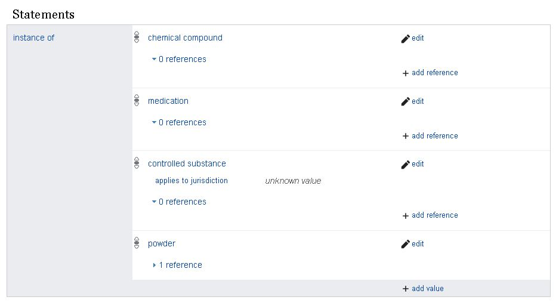
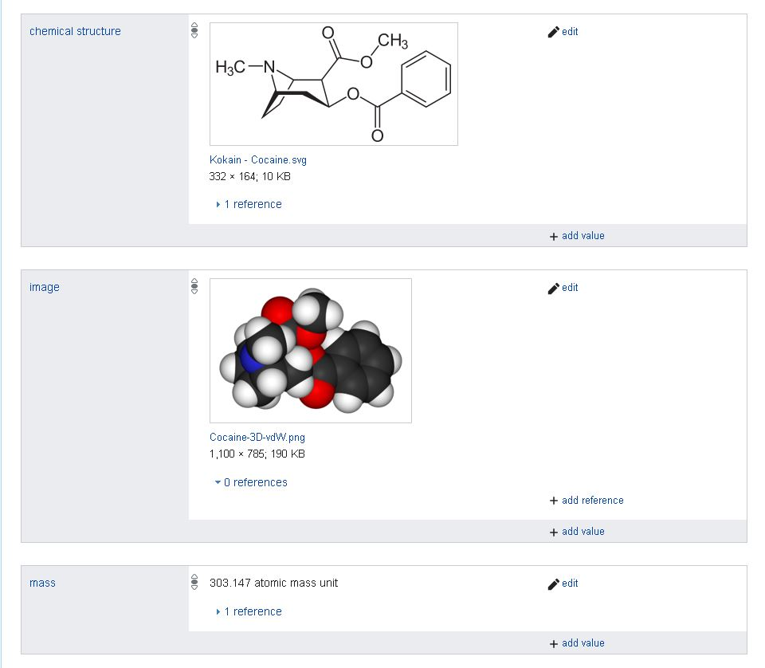
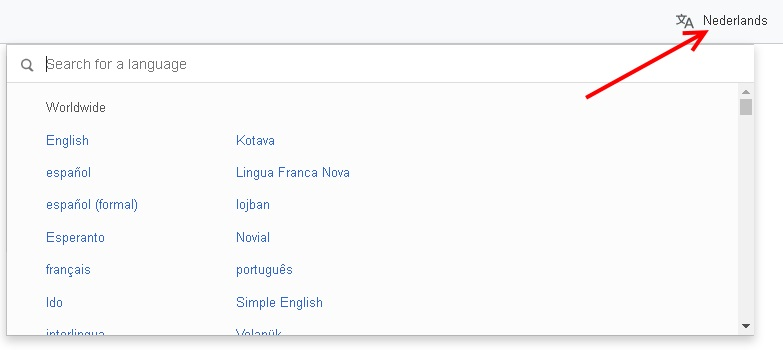
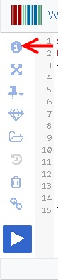
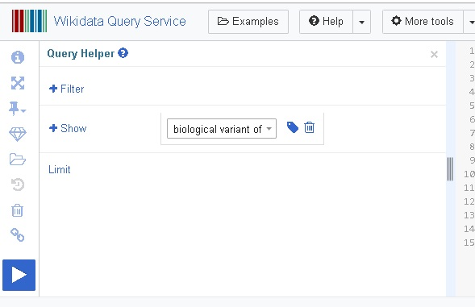

## Q and A:

Several questions were asked during the workshop. Below, you can find these questions and answers:

**Q1: Which relationships (aka properties) are part of Wikidata (related to biology/chemistry)?**

Expanding a query with relevant information only works, if you know which items are part of the database.
For biology related properties please visit the [WikiProject on_Molecular_biology](https://www.wikidata.org/wiki/Wikidata:WikiProject_Molecular_biology/Properties).
For chemistry related properties please visit the [WikiProject on_Chemistry](https://www.wikidata.org/wiki/Wikidata:WikiProject_Chemistry/Properties).

These are quite long lists however, therefore going to the entry page of a relevant item on Wikidata can also help.
As an example, we will look at the entry page of [Cocaine](https://www.wikidata.org/wiki/Q41576).

The first statement group (see also [presentation](../Presentation_introRDF.pdf), slide 17) gives the main labels for this entry in different language. 
Various trivial names for this compound are also provided.

The second statement group explains to which group of resources this entry belongs:



'Cocaine' (object) has been classified to belong to the group of 'chemcial compound'(subject) by the relationship 'instance of'.
There are more resource groups where cocaine belongs to, such as 'medication', 'controlled substance' and 'powder'.

We can find more relationships for cocaine, by scrolling down the page:



Here, we can see that there is also a chemical structure available as an SVG image, and a space filling model image.
Last, there is also a mass provided in atomic mass units. Both the chemical structure drawing and the mass properties have a reference attached to them. These can be unfolded by clicking on the link. This information gives provenance to the data in Wikidata, and can of course be queried from there with a SPARQL query.

**Q2: How do I change the language settings of the SPAQRL Endpoint?**

Answer: Several participants noticed that their results were displayed in Dutch (Nederlands) when they opened the SPARQL endpoint. This setting can be changed in the top right corner:



**Q3: How can I obtain the query helper menu?**

Answer: On the top left side, click on the blue 'i'. This opens up a separate menu, which helps you to construct queries, and see which properties (aka relationships) you want to query:



By clicking this button, the Query constructor will expand:



**Issue Tracker:**

If you are not new to GitHub, you can add other questions to the [issues tracker](https://github.com/BiGCAT-UM/SPARQLTutorialBioSB2019/issues).
If you are new to GitHub, please consult the following documentation on getting an [account](https://www.wikihow.com/Create-an-Account-on-GitHub) and adding an [issue](https://help.github.com/en/articles/creating-an-issue).

Please note that we will maintain this project for reflection purposes of participants (or others that are interested).
New assignments will be created on the [main project](https://github.com/DeniseSl22/SPARQLTutorialBioSB2019). Other SPARQL tutorials given by BiGCaT (Maastricht University) in the future can be found in our [repository list](https://github.com/bigcat-um).

**SERVICE clause additional information:**

The SERVICE element is a neat trick build into the SPARQL endpoint of Wikidata.
The SPARQL way of getting the label of an item, is depicted in the following example"

```sparql
OPTIONAL {
		?event rdfs:label ?eventLabel.
		FILTER(LANG(?eventLabel) = "en").
	}
```

If we would integrate this into the example of [Assignment 1](../Assignments/assignment1.md), we would get the following query"

```sparql
SELECT ?geneLabel ?variantLabel
WHERE
{ 
	VALUES ?disease {wd:Q188874}
    ?variant wdt:P3358 ?disease ; # P3358 Positive prognostic predictor
          wdt:P3433 ?gene . # P3433 biological variant of
	OPTIONAL {?gene rdfs:label ?geneLabel.
		FILTER(LANG(?geneLabel) = "en").
	}
  
  OPTIONAL {?variant rdfs:label ?variantLabel.
		FILTER(LANG(?variantLabel) = "en").
	}
  
}
```
