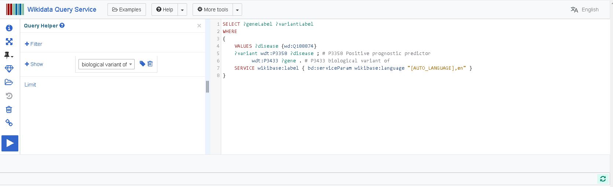
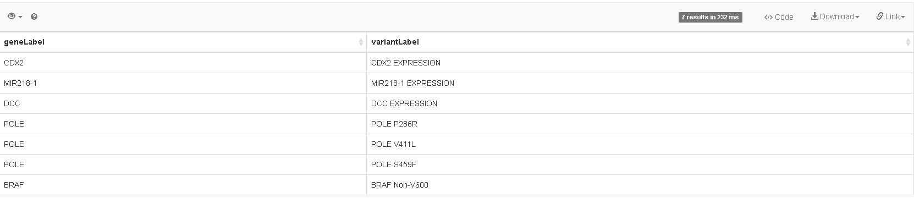
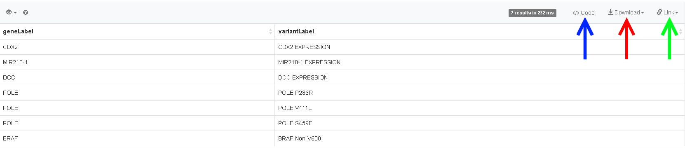

[HOME](https://DeniseSl22.github.io/SPARQLTutorials/)

## Run and Save

Click on [this link](https://www.wikidata.org/wiki/Wikidata:SPARQL_query_service/queries/examples#Which_variant_of_which_gene_predicts_a_positive_prognosis_in_colorectal_cancer) to go to the example page of Wikidata. Below the Query titled "Which variant of which gene predicts a positive prognosis in colorectal cancer", click on the "Try it" button, which will open the following page:

**Welcome to the SPARQL Endpoint of Wikidata!** 

Excecute the query by clicking on the blue play button.
This will reveal the results of the query in a panel below the query editor:

There are several options to work with the results of your query. To save your data, click on the Download button (red arrow in image below), and select the format you want to work with (CSV, TSV, JSON, HTML, SVG-image). To get a weblink to your results, click on the Link button (green arrow in image below). Last, there are also several code examples available (blue arrow in the image below), which could help construct a script to automate (several) queries, or combine the results of multiple queries in a workflow. Examples are available for: R, Python, Ruby, Perl, Java, JavaScript and many others!

We will now make some changes to this query, to understand the structure of SPARQL even better, in the [next exercise](../Assignments/assignment1C.md).

[HOME](https://DeniseSl22.github.io/SPARQLTutorials/)
