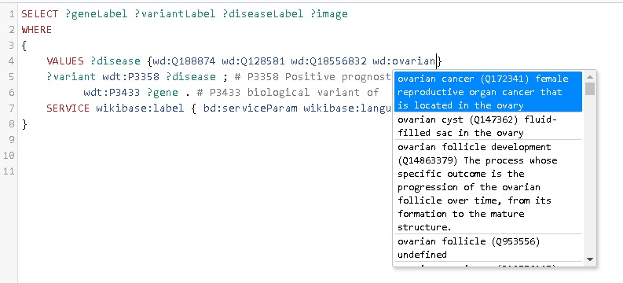
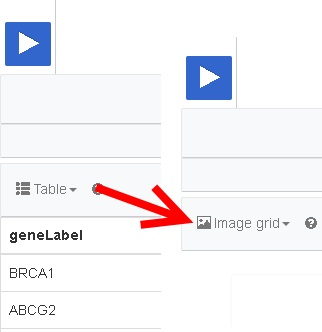
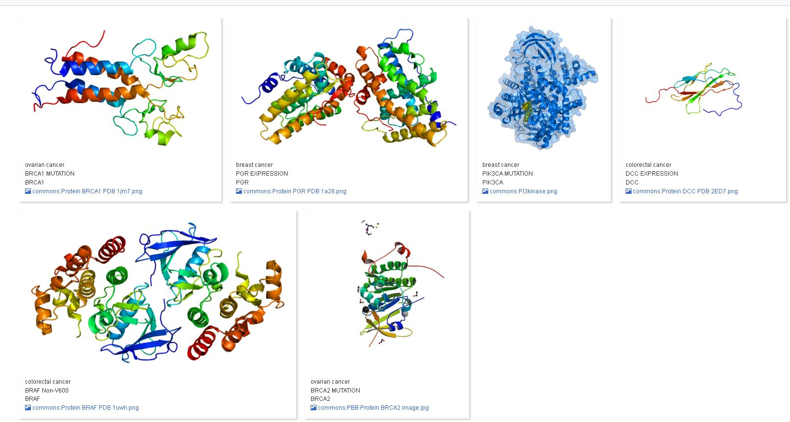

[HOME](https://DeniseSl22.github.io/SPARQLTutorials/)

## Change is Coming 

### More diseases:
We have now limited ourselves to only one disease, colorectal cancer. If we would like to add another disease, such as "breast cancer" (Q128581), we would need change the VALUES line in our query (original below):

```sparql 
{ 
	VALUES ?disease {wd:Q188874}
}
```

By adding the identifier (Q128581) for the Wikidata entry called "breast cancer" to the VALUES element, we can expand our query to include two diseases. Change the line depicted above in the SPARQL endpoint to the following and click the blue run button again:

```sparql 
{ 
	VALUES ?disease {wd:Q188874 wd:Q128581}
}
```

You should now see more results, compared to our previous endeavour.

**Question 3:** How will the line above look, when we also want to add stomach carcinoma (Q18556832) to our list?

(Answers can be found [here](../Answers/AnswersAssignment1.md)). 

### Which diseases?
Since we are obtaining more results by adding more diseases to our query, it would be great if we know to which disease which variant is related. In order to obtain the disease in the results, we should change the _result clause_ section of our SPARQL query:

```sparql 
SELECT ?geneLabel ?variantLabel ?disease
```

Click the play button again; there should now be three columns in your results panel... However, the disease column is only giving us the identifier from Wikidata, not the name of the disease.

**Question 4:** How should the line above look, when we want to see the name of the disease in our results panel?

(Answers can be found [here](../Answers/AnswersAssignment1.md)). 

### Easier querying: Adding diseases with entry search function
Finding the identifiers for each entry you are interested in, can be done very easily with the entry search function. If we would like to add the disease "ovarian cancer" to our list of diseases of interest, we could do the follwing:
1. In the SPARQL endpoint, find the VALUES line.
1. Click just before the last curly bracket '}' .
1. Type a space ' ', and then 'wd:' .
1. Now hit Ctrl and the spacebar on your keyboard simultaneously (Windows, for Apple: CMD in stead of Ctrl).
This should open up the entry search field of Wikidata (see image below).


1. Type the words 'ovarian cancer' in the search field, which should trigger a search in all entries in Wikidata (see image below).


1. Click on the entry with identifier Q172341; this adds the identifier to your list of VALUES.
1. Run your query again.

### Adding protein images
The SPARQL endpoint of Wikidata has several interesting data visualisation options; we will use one to add protein domain images for the genes we just queried.
1. Just above the SERVICE element, add the following line:

```SPARQL
?gene wdt:P18 ?image .
```
2. Click on the play button... What just happened? We had 13 variants, and now the results went down to 6?!

Since not all genes have an image in Wikidata, we are only retrieving the ones that have an image. This can be avoided by using an OPTIONAL statement, such as:
```SPARQL
OPTIONAL{?gene wdt:P18 ?image }.
```

However, we are not seeing the images in our results panel. Every time we want to see a variable that we are querying, we need to add it to the SELECT statement.
1. Change the SELECT statement to the following:
```SPARQL
SELECT ?geneLabel ?variantLabel ?diseaseLabel ?image
```
2. Click on the play button... We do not see the images directly, we do get a link to the images in a Table. If we want to actually see the images, we need to change the visualisation options of the SPARQL endpoint. 
3. Directly under the Run button, there is an option called 'Table". Click on this option, and select the option "Image Grid":



Now, the genes in Wikidata which have an image connected to them, are displayed.



If you would like to have images for all the genes you queried, you can add these to Wikidata yourself. Since the data in Wikidata is built by community efforts, everyone can get involved. If you would like to know more about becoming a database editor and/or curator for Wikidata, ask one of the instructors for more information.

## Next assignments:

You can now either progress to [Assignment 2](../Assignments/assignment2.md), where we will discuss another query in more detail, or stay with the current query to adapt it to your own needs. Several example questions to work on are given in this [additional assignment](../Assignments/assignment1D.md).

[HOME](https://DeniseSl22.github.io/SPARQLTutorials/)

